# Python+Django协同过滤算法房源推荐系统 机器学习 房产推荐系统(基于用户+基于物品双算法、可视化、地图API)

## 要求
### 源码有偿！一套(论文 PPT 源码+sql脚本)

https://www.bilibili.com/video/BV1w44y1a7Qf?spm_id_from=333.999.0.0

### 

### 加好友前帮忙start一下，并备注github有偿获取源码
### 我的QQ号是2877135669 或者 1679232425
### 加qq好友说明（被部分 网友整得心力交瘁）：
    1.加好友务必按照格式备注
    2.避免浪费各自的时间！
    3.当“客服”不容易，repo 主是体面人，不爆粗，性格好，文明人。

## 创新点

地图API

echarts统计图

多角色登录(用户+管理员)

[机器学习](https://www.zhihu.com/search?q=机器学习&search_source=Entity&hybrid_search_source=Entity&hybrid_search_extra={"sourceType"%3A"article"%2C"sourceId"%3A440047794})之协同过滤算法(基于用户推荐+基于物品推荐双算法)

## 说明

适合大数据毕业设计、算法毕业设计、数据分析毕业设计、人工智能、Python毕业设计等

## 运行截图

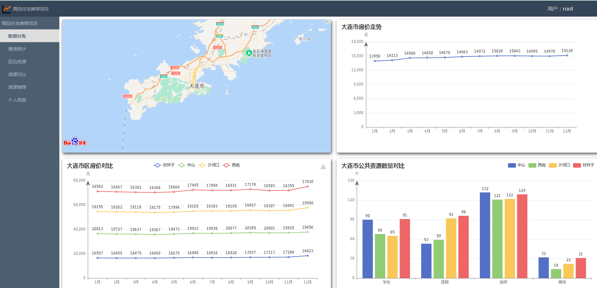

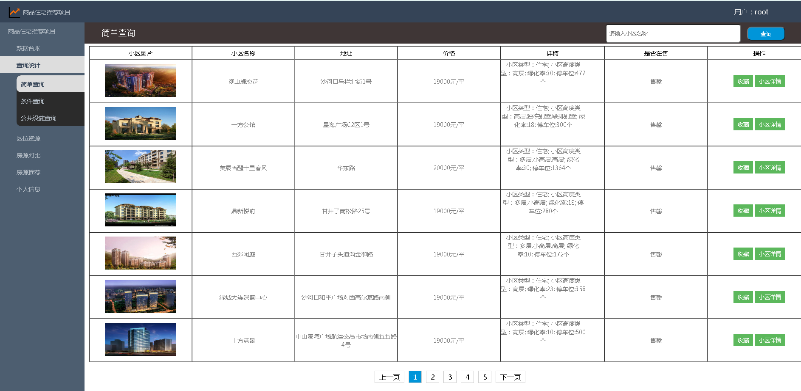

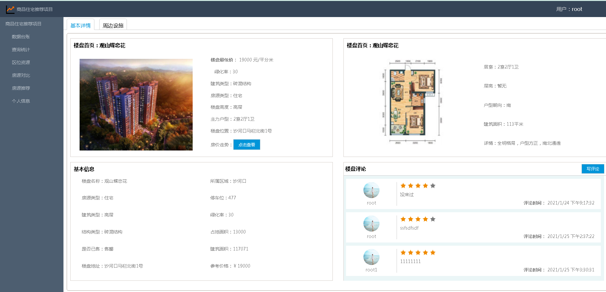

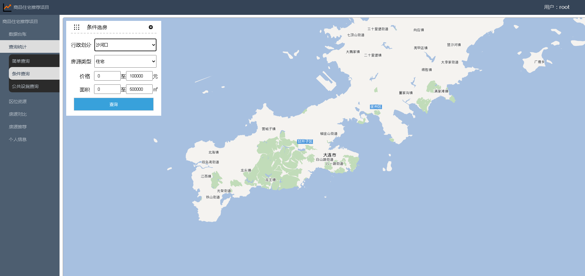

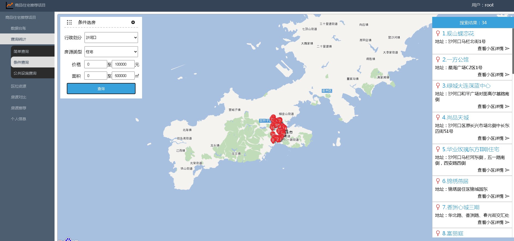

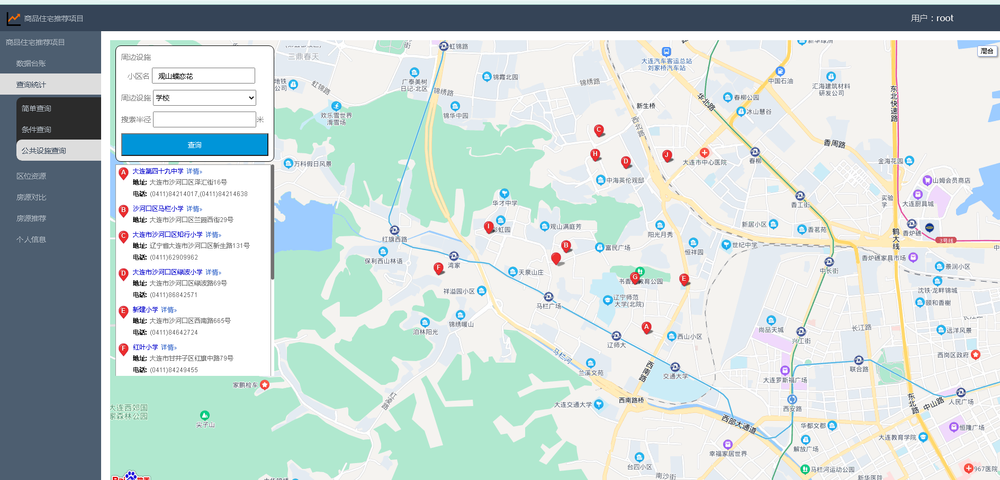

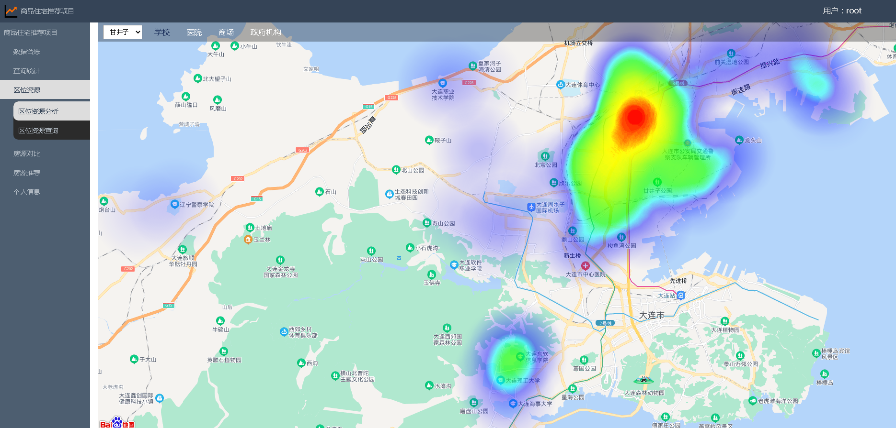

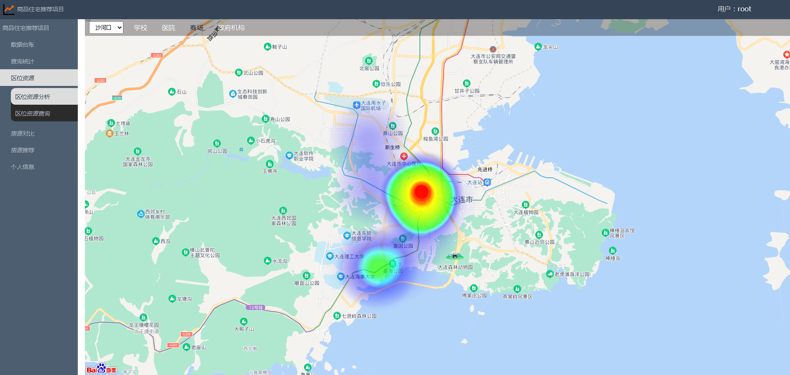

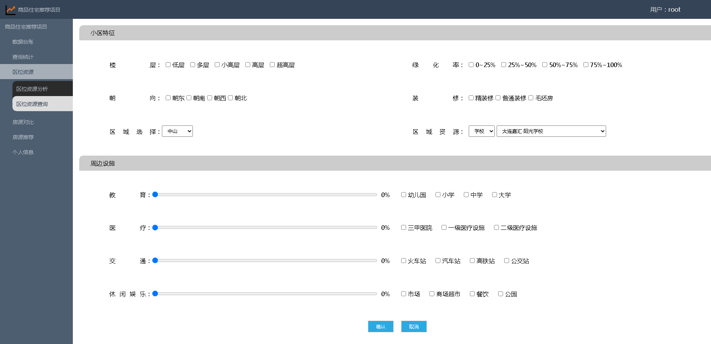

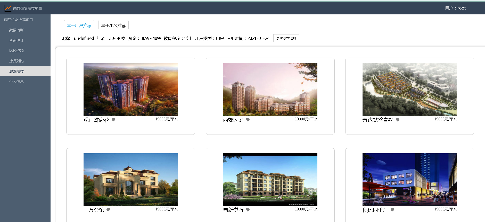

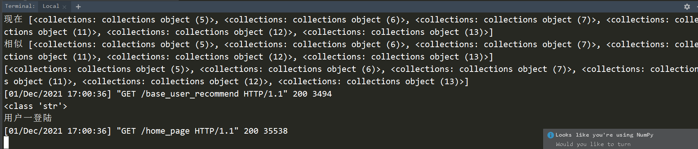

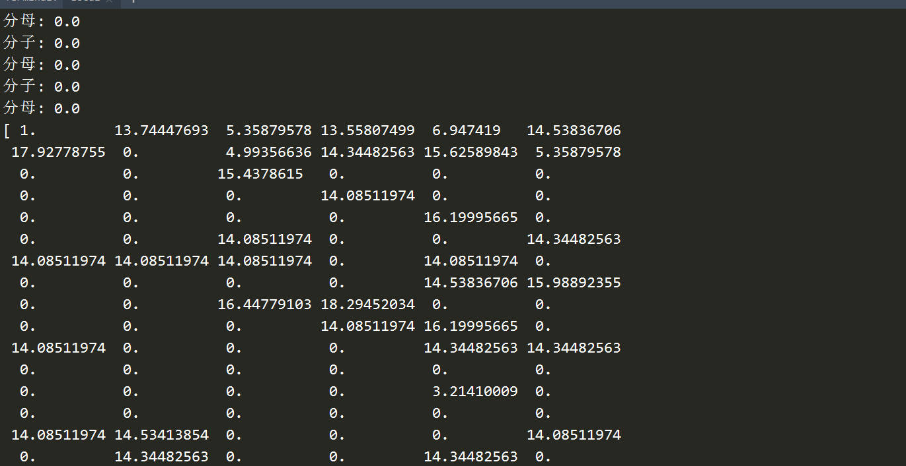

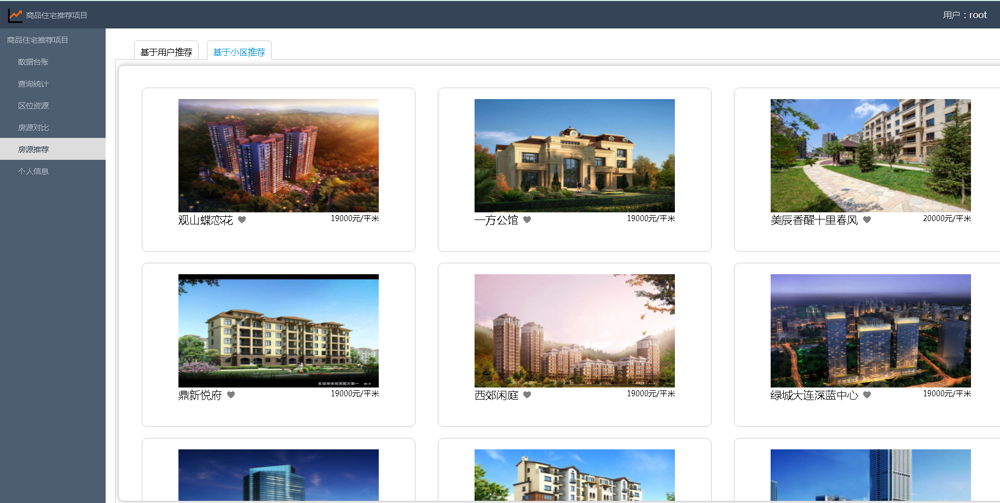

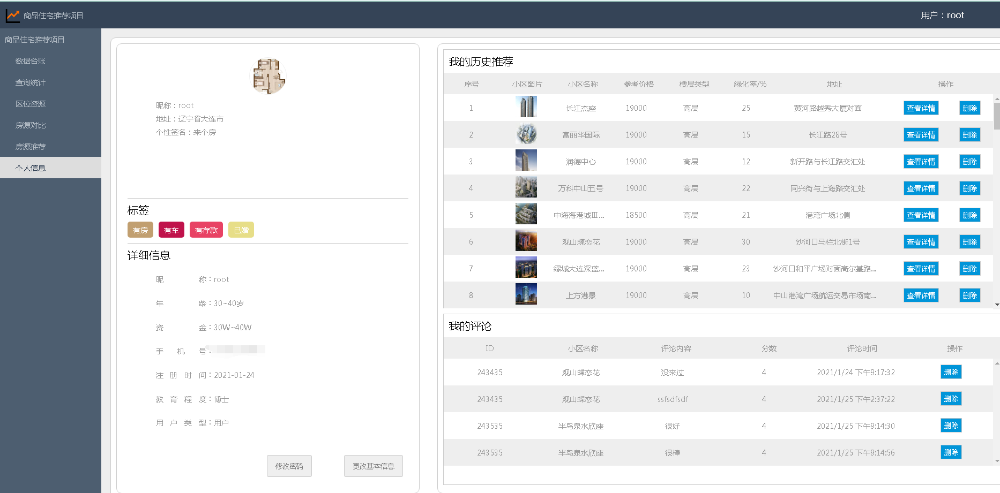

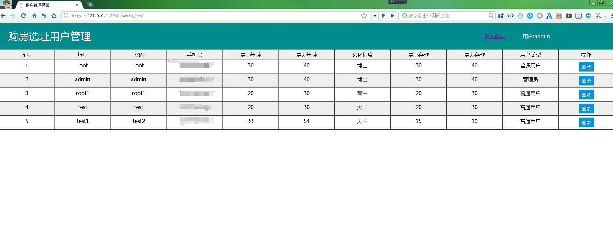

# 运行视频(B站)

https://www.bilibili.com/video/BV1w44y1a7Qf?spm_id_from=333.999.0.0

